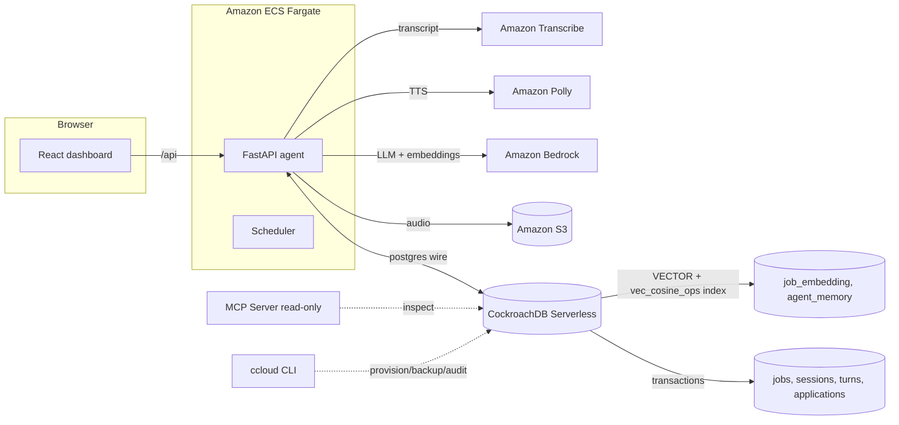

# ApplyCanary — Hackathon Submission

**Agentic job search with a CockroachDB memory layer, deployed on AWS.**

One-paragraph pitch: ApplyCanary is an agent that runs your job search end to
end — it finds postings on ten job boards, scores them against your real
resume, tailors ATS-safe CVs (with an anti-fabrication truthcheck), and then
**practises interviews with you out loud**: a spoken coach asks the questions a
real interviewer would, hears your answers, and scores them against the
rubric — remembering you across sessions.

The memory layer is the product. Every interview is a state machine in
CockroachDB; every answer is evaluated and stored with an embedding; the coach
semantically recalls your past feedback before each new session. Memory is not
an afterthought bolted on for the demo — it is the reason the coach gets better
with every run.

---

## CockroachDB tools used (3 of the required 2)

### 1. CockroachDB Distributed Vector Indexing — the core retrieval engine
- Native `VECTOR(1024)` columns on `job_embedding` and `agent_memory`, backed
  by a distributed `vec_cosine_ops` index (`app/db.py`,
  `app/models.py`).
- Nearest-neighbour search is **SQL executed in the database**:
  `1 - vec_cosine_distance(embedding, :q::vector)` in
  `app/memory/vectors.py` — no separate vector store, no reindexing, no
  consistency gap between the embedding and the row it describes.
- Used for: **similar roles** on every job page, **semantic job search**, and
  **agent-memory recall** (the coach pulls the most relevant past feedback
  before evaluating a new answer).
- Embeddings come from **Amazon Bedrock Titan** when AWS is configured, with a
  deterministic local embedder so the app runs zero-config (CI, offline, demo).

### 2. CockroachDB Cloud Managed MCP Server — safe agent access to the cluster
- `mcp/cockroachdb-mcp.json` + `mcp/README.md`: the single-config snippet from
  the Cloud Console, wired into Claude Code / Cursor / VS Code.
- The agent uses MCP tools read-only: schema inspection before `sync_schema`
  runs, verifying the vector index with `SHOW INDEX`, and `EXPLAIN (VECTOR)`
  to confirm the planner uses it. Read-only by default, full audit logging —
  every agent query is recorded.

### 3. ccloud CLI — the agent's control plane
- `scripts/ccloud/`: provision, status, backup, audit — JSON output on every
  command, service-account RBAC.
- The agent provisions the serverless cluster, enables nightly backups,
  sanity-checks memory-layer row counts, verifies the vector index, and tails
  the audit log.

### 4. CockroachDB Agent Skills (open-source repo) — loaded by `AGENTS.md`
- The project wires `cockroachlabs/cockroachdb-skills` into any agent working
  in the repo (`AGENTS.md`): onboarding/migrations, query & schema design,
  performance (vector index usage), security & governance, resilience.

## AWS services used

| Service | Role in the agent |
|---|---|
| **Amazon Bedrock** | Claude foundation-model inference (via the `converse` API, in the LLM provider chain) + **Titan embeddings** for the vector index |
| **Amazon Polly** | Neural TTS — the spoken interviewer |
| **Amazon Transcribe** | Streaming STT — hears the candidate's answers (16 kHz PCM streaming) |
| **Amazon S3** | Interview audio recordings (versioned, private) |
| **Amazon ECS / Fargate** | Containerized agent (web + scheduler in one task) behind an ALB, with IAM least-privilege and SSM-stored secrets |
| **CloudWatch** | Logs/metrics, ALB access logs |

## Architecture

## How the judging criteria are met

### Agentic Memory Design
Memory is load-bearing, not decorative. Four concrete mechanisms, all in
CockroachDB: (1) **transactional state** — interview sessions and turns are
rows; reload the page and the interview resumes mid-question; (2) **embeddings**
— every memory and job carries a vector, and retrieval is semantic SQL;
(3) **long-term recall** — the coach recalls your past feedback before each
evaluation and says so in the UI ("🧠 Coach remembers"); (4) **learning** —
each finished session is written back as an embedded memory, so the next
session starts smarter. The Memory page shows the improvement trend the
memory layer can tell about you.

### Technical Implementation
- CockroachDB features are used correctly: real vector columns, a real
  `vec_cosine_ops` index, `vec_cosine_distance` in SQL — with an honest
  Python-distance fallback on SQLite so the whole suite is testable offline.
- Bedrock integration is a first-class member of the multi-provider LLM chain
  with automatic failover; Polly/Transcribe degrade to browser speech APIs, so
  the demo works with zero credentials and gets better with AWS.
- 193 passing tests, `ruff` clean, TypeScript build clean.

### Real-World Impact
Job search is a real, high-stakes workflow. The interview coach addresses the
part practice tools ignore: hearing yourself answer, being scored against the
actual posting's rubric, and improving across sessions. Memory makes it
personally useful — it learns *your* gaps, not generic advice.

### Production Readiness
- Security: per-user scoping enforced in every handler; scrypt password
  hashing; signed session tokens with version invalidation; invite-gated
  registration; secrets in SSM (never git/image); private S3; least-privilege
  IAM; read-only audited MCP access.
- Observability: `/health` reports scheduler state; CloudWatch logs; ccloud
  audit log; source-health dashboard.
- Resilience: truthcheck gate prevents unverified CVs from being sent;
  auto-submit is off by default and capped per user; scheduler jobs are
  guarded and coalesced; backups enabled by default and scriptable on demand.

### Creativity & Originality
The insight is that an interview coach is *remembering*, not prompting. By
storing session state, answers, rubrics, and feedback as first-class data with
embeddings in the operational database, the coach exhibits continuity across
sessions — a genuinely agentic property — while the vector index that powers
recall is the same index that powers job discovery. One memory layer, two
surprising uses.

## Repository requirements checklist

- ✅ Public, open source: MIT license (`LICENSE`) — set in the repo About.
- ✅ Source, README, dependencies (`requirements.txt`, `package.json`), setup
  and run instructions.
- ✅ Functional demo app URL (deployed on AWS — see `deploy/aws/`).
- ✅ Demo video < 3 min (see `docs/DEMO.md` for the script).
- ✅ Tools used identified above with concrete "what the agent did".
- ✅ Architectural diagram (above).
